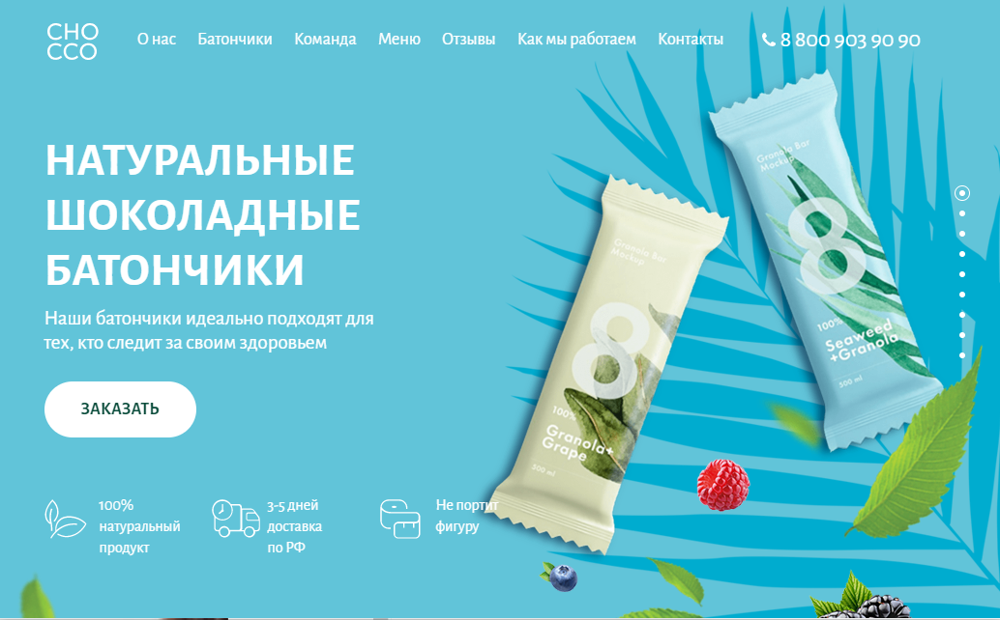

# CHOCCO
## Лендинг батончиков "CHOCCO"

Сайт сверстан на втором курсе "Веб для начинающих" по профессии "Веб-разработчик" в LoftSchool.

***Цель***: Изучить **Gulp**, основы **JavaScript** и работа с **DOM**, препроцессор **SASS**, **SVG**, работу в **Terminal**, основы **Git**,
работу c формами и **AJAX**, **JQuery** и подключение плагинов, подключение **Яндекс карт**. Практика адаптивной и резиновой вёрстки.

#### Workflow
* Gulp
* Git
* Terminal
* NPM

#### Code in native JavaScript
* Accordion
* Form validation

#### JQuery plugins
* bxSlider
* FullPage
#### Other
* BEM-naming
* Adaptive layout
* Flexbox
* SASS
* SVG
* Yandex Map
* Youtube Frame API


## Посмотреть по ссылке: [CHOCCO](https://alkhimovmv.github.io/CHOCCO/)


### Установка зависимостей
```
npm install
```
### Запуск сервера для разработки проекта
```
npm run gulp
```
### Собрать проект
```
npm run build
```
